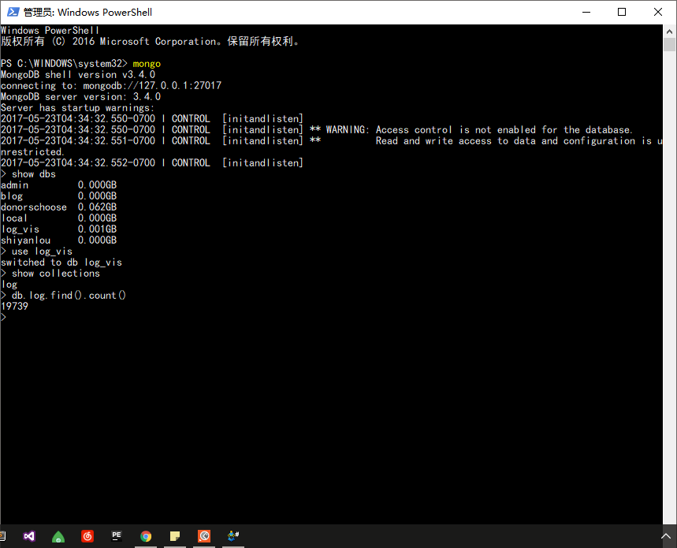
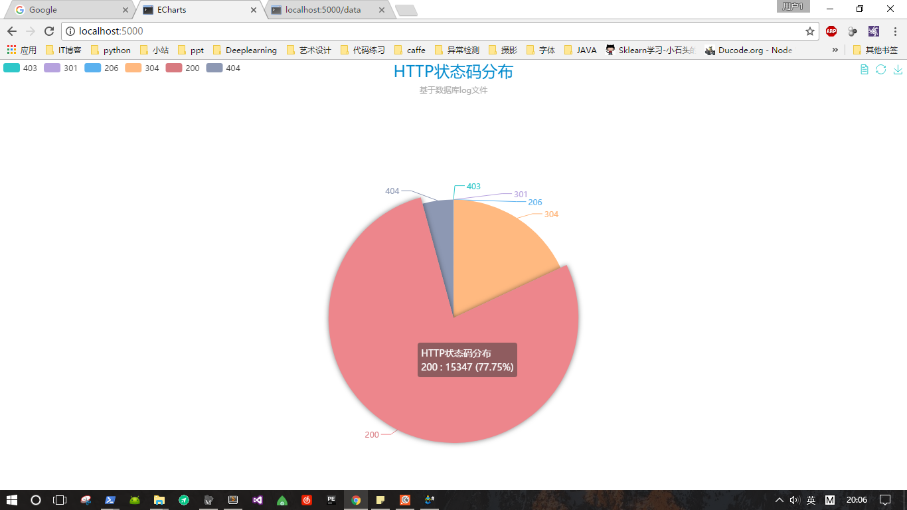
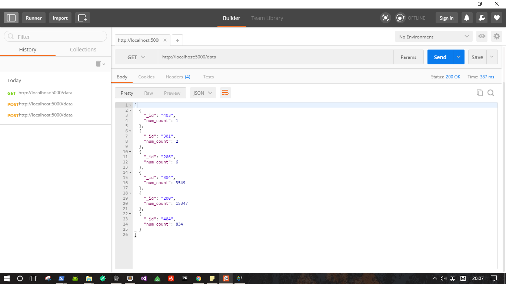

# 基于日志的HTTP状态码可视化 


#### 目的：
##### 从服务器日志数据中获取信息
###### 日志示例
61.159.140.123 - - [23/Aug/2014:00:01:42 +0800] "GET /favicon.ico HTTP/1.1" 404 \ "-" "Mozilla/5.0 (Windows NT 5.1) AppleWebKit/537.36 (KHTML, like Gecko) Chrome/29.0.1547.66 Safari/537.36 LBBROWSER" "-"

#### 所用到的工具：
- MongoDB
- Flask
- echarts3 
- Python

#### 实现过程：
- python做数据预处理，存入mongodb中
- 用flask建立HTTP server
- 使用ajax加载数据到echarts中绘制图形

<br>
<h6 align="center" style = "color:black" >将日志的ip, url, HTTP status抽取出来，存入mongodb</h6>

```python
# -*- coding:utf-8 -*-
from pymongo import MongoClient

conn = MongoClient("localhost", 27017)
db = conn['log_vis']

with open("www_access_20140823.log","r") as f:
    res = {}
    for line in f:
        # 获取IP URL STATUS
        arr = line.split(' ')
        ip = arr[0]
        url = arr[6]
        status = arr[8]
        db.log.insert({
            "ip":ip,
            "url":url,
            "status":status
        })
```

<h6 align="center" style = "color:black" >数据库中共有19739条数据</h6>


<h6 align="center" style = "color:black" >用flask搭建本地服务器</h6>

```python
# -*- coding:utf-8 -*-
from flask import Flask
from flask import render_template
from pymongo import MongoClient
import json
from bson import json_util
from bson.json_util import dumps

app = Flask(__name__)

MONGODB_HOST = 'localhost'
MONGODB_PORT = 27017
DBS_NAME = 'log_vis'
COLLECTION_NAME = 'log'


@app.route("/")
def index():
    return render_template("index.html")

# 该路由用于ajax获取数据
@app.route("/data")
def data():
    connection = MongoClient(MONGODB_HOST, MONGODB_PORT)
    collection = connection[DBS_NAME][COLLECTION_NAME]
    # 统计出 HTTP status 出现的次数
    projects = collection.aggregate([{"$group" : {"_id" : "$status", "num_count" : {"$sum" : 1}}}])
    json_projects = []
    for project in projects:
        json_projects.append(project)
    json_projects = json.dumps(json_projects, default=json_util.default)
    connection.close()

    return json_projects

if __name__ == "__main__":
    app.run(host='0.0.0.0',port=5000,debug=True)
```


<h6 align="center" style = "color:black" >利用echarts对数据进行可视化</h6>

```javascript
<!DOCTYPE html>
<html style="height: 100%">
<head>
    <meta charset="utf-8">
    <title>ECharts</title>
    <!-- 引入 echarts.js -->
    <script src="../static/js/echarts.min.js"></script>
    <script src="../static/js/jquery-3.2.1.js"></script>
    <script src="../static/theme/macarons.js"></script>
</head>
<body style="height: 100%; margin: 0">
<!-- 为ECharts准备一个具备大小（宽高）的Dom -->
<div id="main" style="height: 100%"></div>

<script type="text/javascript">

    $.ajax({
        type: "GET",
        url: "http://localhost:5000/data",
        data: null,
        dataType: "json",
        success: function (data) {
            alert("成功获得响应")
            PieChart(data);
        },
        error: function () {
            alert("请求响应失败");
        }
    });

    function getJsonObjLength(jsonObj) {
        var Length = 0;
        for (var item in jsonObj) {
            Length++;
        }
        return Length;
    }

    function PieChart(data) {

        var id = [];
        var num = [];
        var arr = [];
        var arrayLength = getJsonObjLength(data);
        for (var i = 0; i < arrayLength; i++) {
            id.push(data[i]._id);
            num.push(data[i].num_count);
            var item = {value: data[i].num_count, name: data[i]._id};
            arr.push(item);
        }

        // console.log(id)
        // 基于准备好的dom，初始化echarts实例
        var myChart = echarts.init(document.getElementById('main'),'macarons');
        // 指定图表的配置项和数据

        option = {
            title : {
                text: 'HTTP状态码分布',
                textStyle: {fontSize: 24},
                subtext: '基于数据库log文件',
                x:'center'
            },
            tooltip : {
                trigger: 'item',
                formatter: "{a} <br/>{b} : {c} ({d}%)"
            },
            legend: {
                orient: 'horizontal',
                left: 'left',
                data: id
            },
            toolbox: {
                show: true,
                feature: {
                    dataView: {readOnly: false},
                    // magicType: {show: true, type:['pie','chord']},
                    restore: {},
                    saveAsImage: {}
                }
            },
            series : [
                {
                    name: 'HTTP状态码分布',
                    type: 'pie',
                    radius : '55%',
                    center: ['50%', '60%'],
                    data: arr,
                    itemStyle: {
                        emphasis: {
                            shadowBlur: 10,
                            shadowOffsetX: 0,
                            shadowColor: 'rgba(0, 0, 0, 0.5)'
                        }
                    }
                }
            ]
        };
        myChart.setOption(option,true)
    }

</script>
</body>
</html>

```


<br>
<h6 align="center" style = "color:black" >用Postman对数据接口做测试</h6>


<h6 align="center" style = "color:black" >最终的可视化结果</h6>



#### 展望
##### 这次只用到了HTTP的状态码，接下来会做一个利用IP地址解析出物理地址的Geo可视化。

