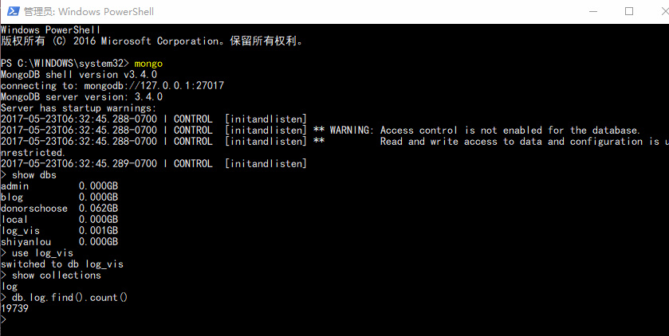
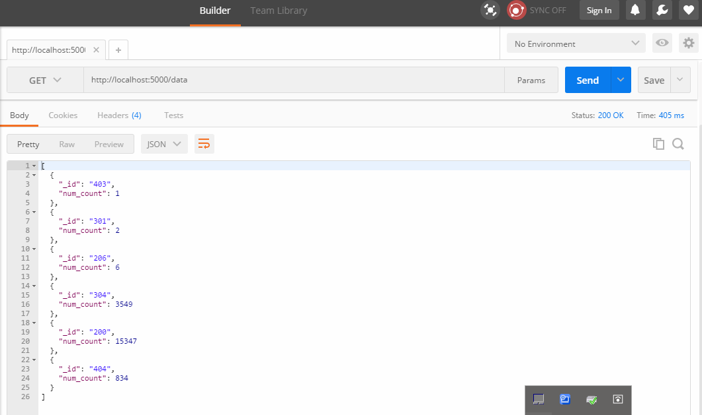
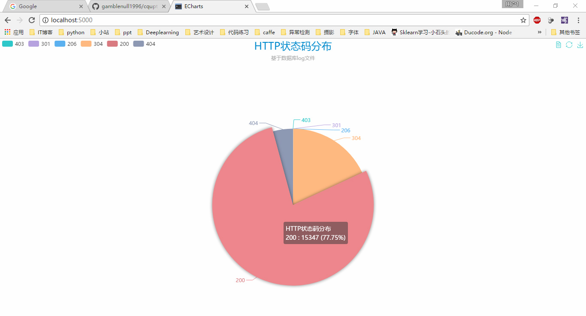
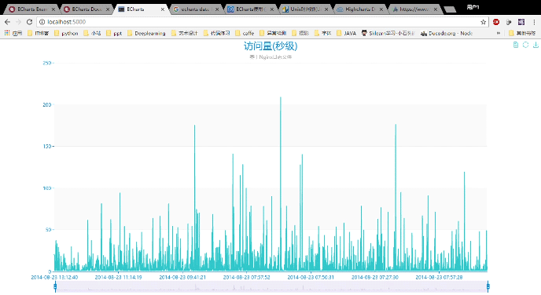
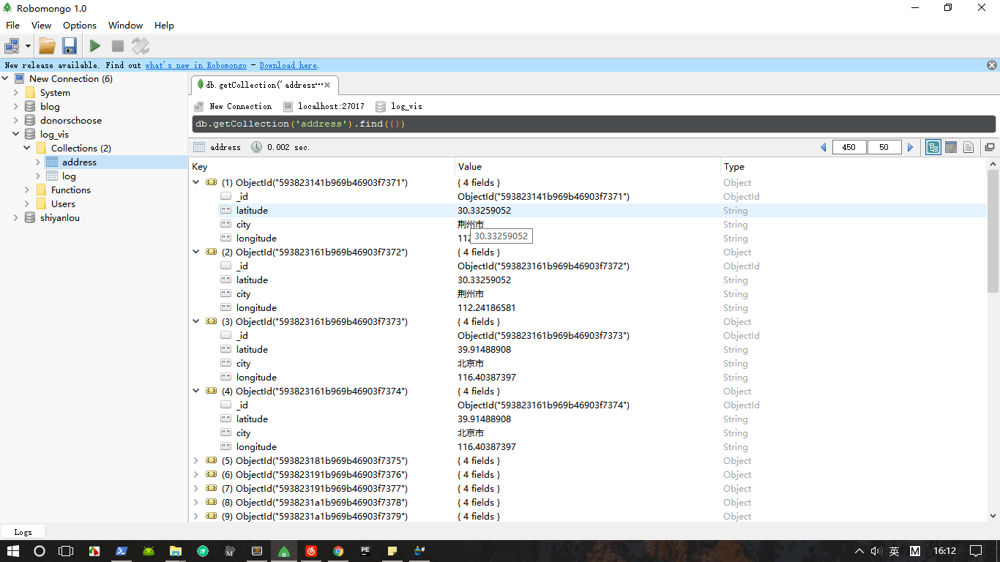
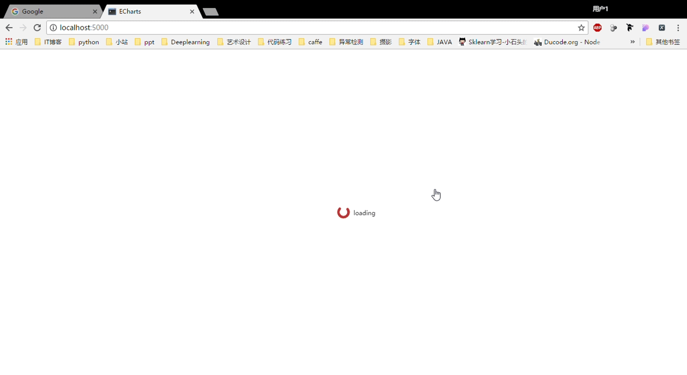

# 基于Nginx日志的HTTP状态码可视化


#### 目的：

##### 从服务器日志数据中获取信息

###### Nginx日志示例

61.159.140.123 - - [23/Aug/2014:00:01:42 +0800] "GET /favicon.ico HTTP/1.1" 404 \ "-" "Mozilla/5.0 (Windows NT 5.1) AppleWebKit/537.36 (KHTML, like Gecko) Chrome/29.0.1547.66 Safari/537.36 LBBROWSER" "-"


#### 所用到的工具：
- MongoDB
- Flask
- echarts3
- Python


#### 运行方式：

- 启动 mongodb mongod --dbpath "C:\data\db"
- 启动 flask python app.py
- 在浏览器中 http://localhost:5000 查看可视化结果
- 更改app.py为render_template("pie_index.html") 查看HTTP stauscode饼图
- 更改app.py为render_template("line_index.html") 查看访问量随时间变化柱状图
- 更改app.py为render_template("geo_index.html")  查看访问IP的地理位置分布


#### 实现过程：
- python做数据预处理，存入mongodb中
- 用flask建立HTTP server
- 通过ajax加载数据到echarts中绘制图形

#### 项目结构：
- data文件夹下是Nginx日志
- img中为README.md文档中的插图
- process为数据库操作和探索数据时编写的脚本
- static下包含要用到的jquery.js,echarts.js和echarts主题
- templates为flask要渲染的页面

<br>
<h6 align="center" style = "color:black" >将日志的ip, url, HTTP status抽取出来，存入mongodb</h6>


```python

# -*- coding:utf-8 -*-
from pymongo import MongoClient

conn = MongoClient("localhost", 27017)
db = conn['log_vis']


with open("www_access_20140823.log","r") as f:
    res = {}
    for line in f:
        # 获取IP URL STATUS
        arr = line.split(' ')
        ip = arr[0]
        url = arr[6]
        status = arr[8]
        db.log.insert({
            "ip":ip,
            "url":url,
            "status":status
        })
```


<h6 align="center" style = "color:black" >数据库中共有19739条数据</h6>



<h6 align="center" style = "color:black" >用flask搭建本地服务器</h6>


```python
# -*- coding:utf-8 -*-
from flask import Flask
from flask import render_template
from pymongo import MongoClient
import json
from bson import json_util
from bson.json_util import dumps


app = Flask(__name__)


MONGODB_HOST = 'localhost'
MONGODB_PORT = 27017
DBS_NAME = 'log_vis'
COLLECTION_NAME = 'log'


@app.route("/")
def index():
    return render_template(pie_index.html)


@app.route("/data")
def data():
    connection = MongoClient(MONGODB_HOST, MONGODB_PORT)
    collection = connection[DBS_NAME][COLLECTION_NAME]
    # 统计出 HTTP status 出现的次数
    projects = collection.aggregate([{"$group" : {"_id" : "$status", "num_count" : {"$sum" : 1}}}])
    json_projects = []
    for project in projects:
        json_projects.append(project)
    json_projects = json.dumps(json_projects, default=json_util.default)
    connection.close()

    return json_projects

if __name__ == "__main__":
    app.run(host='0.0.0.0',port=5000,debug=True)

```

<h6 align="center" style = "color:black" >利用echarts对数据进行可视化</h6>

```javascript
<!DOCTYPE html>
<html style="height: 100%">
<head>
    <meta charset="utf-8">
    <title>ECharts</title>
    <script src="../static/js/echarts.min.js"></script>
    <script src="../static/js/jquery-3.2.1.js"></script>
    <script src="../static/theme/macarons.js"></script>
</head>
<body style="height: 100%; margin: 0">
<div id="main" style="height: 100%"></div>
<script type="text/javascript">

    $.ajax({
        type: "GET",
        url: "http://localhost:5000/data",
        data: null,
        dataType: "json",
        success: function (data) {
            alert("成功获得响应")
            PieChart(data);
        },

        error: function () {
            alert("请求响应失败");
        }
    });


    function getJsonObjLength(jsonObj) {
        var Length = 0;
        for (var item in jsonObj) {
            Length++;
        }

        return Length;
    }


    function PieChart(data) {
        var id = [];
        var num = [];
        var arr = [];
        var arrayLength = getJsonObjLength(data);
        for (var i = 0; i < arrayLength; i++) {
            id.push(data[i]._id);
            num.push(data[i].num_count);
            var item = {value: data[i].num_count, name: data[i]._id};
            arr.push(item);
        }


        // console.log(id)
        var myChart = echarts.init(document.getElementById('main'),'macarons');

        option = {
            title : {
                text: 'HTTP状态码分布',
                textStyle: {fontSize: 24},
                subtext: '基于数据库log文件',
                x:'center'
            },

            tooltip : {
                trigger: 'item',
                formatter: "{a} <br/>{b} : {c} ({d}%)"
            },

            legend: {
                orient: 'horizontal',
                left: 'left',
                data: id
            },

            toolbox: {
                show: true,
                feature: {
                    dataView: {readOnly: false},
                    restore: {},
                    saveAsImage: {}
                }
            },

            series : [
                {
                    name: 'HTTP状态码分布',
                    type: 'pie',
                    radius : '55%',
                    center: ['50%', '60%'],
                    data: arr,
                    itemStyle: {
                        emphasis: {
                            shadowBlur: 10,
                            shadowOffsetX: 0,
                            shadowColor: 'rgba(0, 0, 0, 0.5)'
                        }
                    }
                }
            ]
        };
        myChart.setOption(option,true)
    }

</script>
</body>
</html>
```

<h6 align="center" style = "color:black" >用Postman对数据接口做测试</h6>




<h6 align="center" style = "color:black" >最终的可视化结果</h6>



#### 意义:

从图中可以看出HTTP状态码304的比例为17.98%，而304代表NOT MODIFIED，即缓存命中了，以此可以直观的看出Nginx服务器的缓存命中率。

#### 网站流量图


###### 核心代码其实就一行
```projects = db.log.aggregate([{"$group" : {"_id" : "$time", "count" : {"$sum" : 1}}}])```
###### 同样是用ajax加载json到echarts中，具体配置如下
```javascript
<script type="text/javascript">

    $.ajax({
        type: "GET",
        url: "http://localhost:5000/time",
        data: null,
        dataType: "json",
        success: function (data) {
            alert("成功获得响应")
            LineChart(data);
        },
        error: function () {
            alert("请求响应失败");
        }
    });

    function getJsonObjLength(jsonObj) {
        var Length = 0;
        for (var item in jsonObj) {
            Length++;
        }
        return Length;
    }

    function LineChart(data) {

        var id = [];
        var count = [];
        var arrayLength = getJsonObjLength(data);
        for (var i = 0; i < arrayLength; i++) {
            id.push(data[i]._id);
            count.push(data[i].count);
        }

        // console.log(id);
        // console.log(count);
        var myChart = echarts.init(document.getElementById('main'),'macarons');

        option = {
            title : {
                text: '网站访问量(秒级)',
                textStyle: {fontSize: 24},
                subtext: '基于Nginx日志文件',
                x:'center'
            },
            tooltip : {
                trigger: 'axis',
                axisPointer: {
                    type: 'cross'
                }
            },

            toolbox: {
                show: true,
                feature: {
                    dataView: {readOnly: false},
                    restore: {},
                    saveAsImage: {}
                }
            },

            dataZoom: [
                {
                    show: true,
                    start: 10,
                    end: 90
                },
                {
                    type: 'inside',
                    start: 10,
                    end: 90

                }
            ],
            xAxis: {
                type: 'category',
                data: id
            },

            yAxis: {
                type: 'value',
                axisPointer: {
                    snap: true
                }
            },
            series : [
                {
                    name: '访问量',
                    type: 'line',
                    data: count
                }
            ]
        };
        myChart.setOption(option,true)
    }

</script>

```


#### IP地理地址可视化

从日志中抽取访问者的IP地址，使用百度地图的API，获得IP地址的大概地理位置，经纬度信息，存入mongodb。

```python
# -*- coding:utf-8 -*-

import json
import time
import requests
from ratelimiter import RateLimiter
from pymongo import MongoClient


conn = MongoClient("localhost", 27017)
db = conn['log_vis']

ak = """7L9mxsMyepmGrMoednU5ivCLEnr6Ey1c"""


@RateLimiter(max_calls=100, period=1)
def get_geo(ip):
    url = "https://api.map.baidu.com/location/ip?ak={}&coor=bd09ll&ip={}".format(
        ak, ip)
    try:
        r = requests.get(url)
        json_dict = json.loads(r.text)
        return json_dict
    except:
        print 'Error: geting {} address fail.'.format(ip)
        return 0


def get_id_ip():
    cursor = db.log.find({}, {"ip": 1})
    while True:
        try:
            item = cursor.next()
            id = item['_id']
            ip = item['ip']
            mydict = get_geo(ip)

            if mydict.get('status') == 0:
                city = mydict['content']['address_detail']['city']
                x = mydict['content']['point']['x']
                y = mydict['content']['point']['y']

                db.address.insert({
                    "city": city,
                    "longitude": x,
                    "latitude": y
                })
                print "adding city:%s longitude:%s latitude:%s into database" % (city, x, y)

        except StopIteration:
            break

def new_get_id_ip():
    cursor = db.log.find({}, {"ip": 1})
    while True:
        try:
            item = cursor.next()
            id = item['_id']
            ip = item['ip']
            mydict = get_geo(ip)

            if mydict.get('status') == 0:
                city = mydict['content']['address_detail']['city']
                x = mydict['content']['point']['x']
                y = mydict['content']['point']['y']

                db.address.insert({
                    "city": city,
                    "longitude": x,
                    "latitude": y
                })
                print "adding city:%s longitude:%s latitude:%s into database" % (city, x, y)

        except StopIteration:
            break


if __name__ == '__main__':
    start = time.time()
    get_id_ip()
    stop = time.time()
    # 使用迭代器，最终插入了18773条数据到新的数据库中，花了7754秒
    # API配额是每天10万次，每分钟并发6000次
    print "Time costed:{}".format(stop - start)

```


<h6 align="center" style = "color:black" >得到的address文档的结构</h6>



##### Echarts的series.data是定义图表数据内容的数组其数据格式如下所示

```
{
	name: '北京',    // 数据项名称，在这里指地区名称
	value: [        // 数据项值
		116.46,     // 地理坐标，经度
		39.92,      // 地理坐标，纬度
		340         // 北京地区的数值
	]
}
```
##### 按上述格式构造json

```python
@app.route("/geo")
def geo():
    city_set = set()
    info_dict = {}

    conn = MongoClient("localhost", 27017)
    db = conn['log_vis']
    result = db.address.find({}, {"city":1, "latitude":1, "longitude":1 ,"_id":0})

    for item_dict in result:
        city = item_dict.get("city")
        # 纬度
        latitude = item_dict.get("latitude")
        # 经度
        longitude = item_dict.get("longitude")
        # 有脏数据 没有城市名 只有经纬度
        if len(city) != 0:
            city_set.add(city)
            info_dict[city] = [longitude, latitude]


    for city in city_set:
        count = db.address.find({"city": city}).count()
        [longitude, latitude] = info_dict[city]
        info_dict[city] = [longitude, latitude, count]

    final_json = []
    for key, value in info_dict.items():
        record = {"name": key, "value": value}
        final_json.append(record)

    json_projects = json.dumps(final_json, default=json_util.default)
    conn.close()

    return  json_projects
```

##### 使用ajax请求json数据，载入echarts

```javascript
<script type="text/javascript">

    var myChart = echarts.init(document.getElementById('main'));

    myChart.showLoading();

    $.ajax({
        type: "GET",
        url: "http://localhost:5000/geo",
        dataType: "json",
        success: function (data) {
            var option = optionFactory(data);
            myChart.hideLoading();
            myChart.setOption(option);
        },
        error: function () {
            alert("请求响应失败");
        }
    });


    function optionFactory(data) {

        var option = {
            title: {
                text: '访问网站的IP分布',
                subtext: '基于Nginx日志',
                left: 'center',
                textStyle: {
                    color: '#fff'
                }
            },

            geo: {
                map: 'china',

                itemStyle: {
                    normal: {
                        areaColor: '#323c48',
                        borderColor: '#111'
                    },
                    emphasis: {
                        areaColor: '#2a333d'
                    }
                }
            },

            tooltip: {
                trigger: 'item'
            },

            backgroundColor: '#404a59',
            series: [{
                name: 'IP访问量',
                type: 'scatter',
                coordinateSystem: 'geo',
                data: data,
                symbolSize: function (val) {
                    return Math.max(val[2] / 30, 15);
                }
            }],
            //添加visualmap
            visualMap: {
                type: 'continuous',
                min: 0,
                max: 2000,
                calculable: true,
                inRange: {
                    color: ['#50a3ba', '#eac736', '#d94e5d']
                },
                textStyle: {
                    color: '#fff'
                }
            }
        };
        return option;
    }

```
#### 最终效果图




#### 展望
将上述图表制作成Dashboard